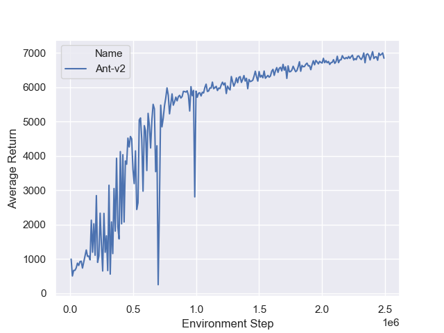
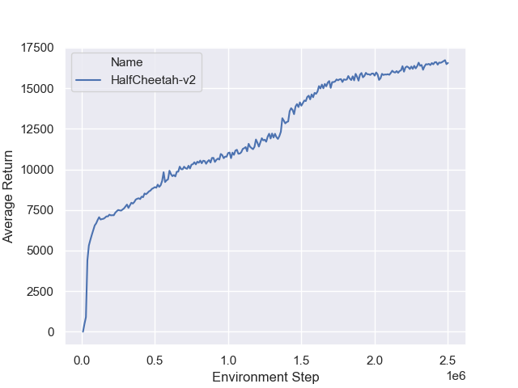

# An Off-Policy Reinforcement Learning Template

This repository establishes a *high-performing*, *efficient*, and *minimally implemented* framework for off-policy reinforcement learning. My intention in creating this framework is to give researchers a tool for rapid prototyping and research in off-policy and offline reinforcement learning. I have implemented [Soft Actor Critic](https://arxiv.org/pdf/1812.05905.pdf) with entropy tuning as a base, but many other variants can be made with only simple modifications to one or two files.

## A Note On Performance

Despite the minimal style of this framework, performance with our SAC implementation is comparable to and occasionally better than results obtained with the original SAC implementation.

<p align="center"></p>

This is due to input normalization, and weight initialization strategies.

## Installation

To use the framework as is, with no algorithmic modifications, you can download the template from github and install it using the following commands in a terminal window.

```
conda create off-policy python=3.7
conda activate off-policy
conda install cudatoolkit=10.1
conda install cudnn=7.6
git clone https://github.com/brandontrabucco/off-policy.git
pip install -e off-policy
```

These commands will create a conda environment to manage the packages for `off-policy`, and will install the appropriate GPU drivers. I highly recommend running `off-policy` on a GPU, since I have optimized for it.

## Usage

The framework includes a python interface for launching experiments and logging results, which can be called like this. 

```python
from offpolicy import soft_actor_critic

config = dict(logging_dir="cheetah",
              eval_env="HalfCheetah-v2",
              training_env="HalfCheetah-v2",
              buffer_capacity=1000000,
              hidden_size=256,
              policy_lr=3e-4,
              qf_lr=3e-4,
              alpha_lr=3e-4,
              constraint=None,
              reward_scale=1.0,
              discount=0.99,
              target_tau=5e-3,
              target_delay=1,
              episodes_per_eval=10,
              warm_up_steps=5000,
              batch_size=256,
              training_iterations=5000000,
              eval_interval=10000)
              
soft_actor_critic(config)
```

In addition, there is a script for launching many experiments managed by `ray.tune`, which can be called like this.

```bash
python train.py \
  --logging-dir cheetah \
  --evan-env HalfCheetah-v2 \
  --training-env HalfCheetah-v2 \
  --cpus 8 \
  --gpus 1 \
  --num-parallel 1 \
  --num-samples 1
```

## Efficiency

From my experiments, it takes roughly three hours for the framework to reach one million training steps on the Ant-v2 MuJoCo environment. This number was found by training a single agent on a Titan RTX GPU.